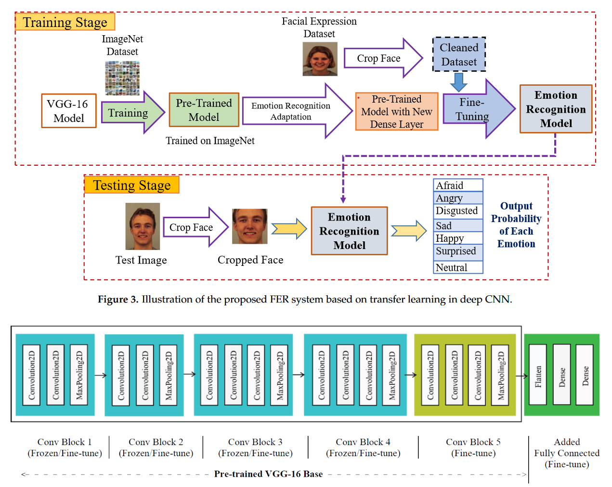

Official implementation of our paper:

> [**Facial Emotion Recognition Using Transfer Learning in the Deep CNN**](https://arxiv.org/abs/2306.01195)  
> M. A. H. Akhand, Shuvendu Roy, Nazmul Siddique, Md Abdus Samad Kamal, and Tetsuya Shimamura. <br>
> \*In Electronics 2024

[](https://paperswithcode.com/sota/facial-expression-recognition-on-jaffe?p=facial-emotion-recognition-using-transfer)

<p align="center"> 
 
</p>

<h1 align="center"> 
Facial Emotion Recognition Using Transfer Learning in the Deep CNN
</h1>
<h3  align="center">
MAH Akhand, <a href="https://shuvenduroy.github.io">Shuvendu Roy</a>, Nazmul Siddique, Md Abdus Samad Kamal, Tetsuya Shimamura
</h3>

<br>

**Abstract**: Mapping different facial expressions to the respective emotional states are the main task in FER. The classical FER consists of two major steps: feature extraction and emotion recognition. Currently, the Deep Neural Networks, especially the Convolutional Neural Network (CNN), is widely used in FER by virtue of its inherent feature extraction mechanism from images. Several works have been reported on CNN with only a few layers to resolve FER problems. However, standard shallow CNNs with straightforward learning schemes have limited feature extraction capability to capture emotion information from high-resolution images. A notable drawback of the most existing methods is that they consider only the frontal images (i.e., ignore profile views for convenience), although the profile views taken from different angles are important for a practical FER system. For developing a highly accurate FER system, this study proposes a very Deep CNN (DCNN) modeling through Transfer Learning (TL) technique where a pre-trained DCNN model is adopted by replacing its dense upper layer(s) compatible with FER, and the model is fine-tuned with facial emotion data. A novel pipeline strategy is introduced, where the training of the dense layer(s) is followed by tuning each of the pre-trained DCNN blocks successively that has led to gradual improvement of the accuracy of FER to a higher level. The proposed FER system is verified on eight different pre-trained DCNN models (VGG-16, VGG-19, ResNet-18, ResNet-34, ResNet-50, ResNet-152, Inception-v3 and DenseNet-161) and well-known KDEF and JAFFE facial image datasets. FER is very challenging even for frontal views alone. FER on the KDEF dataset poses further challenges due to the diversity of images with different profile views together with frontal views. The proposed method achieved remarkable accuracy on both datasets with pre-trained models. On a 10-fold cross-validation way, the best achieved FER accuracies with DenseNet-161 on test sets of KDEF and JAFFE are 96.51% and 99.52%, respectively. The evaluation results reveal the superiority of the proposed FER system over the existing ones regarding emotion detection accuracy. Moreover, the achieved performance on the KDEF dataset with profile views is promising as it clearly demonstrates the required proficiency for real-life applications.

### Citation
Please cite our paper using the given BibTeX entry.
```
@article{roy2021facial,
  title={Facial Emotion Recognition Using Transfer Learning in the Deep CNN},
  author={Akhand, MAH and Roy, Shuvendu and Siddique, Nazmul and Kamal, Md Abdus Samad and Shimamura, Tetsuya},
  journal={Electronics},
  volume={10},
  number={9},
  pages={1036},
  year={2021},
  publisher={Multidisciplinary Digital Publishing Institute}
}
```


### Question
You may directly contact me at <shuvendu.roy@queensu.ca> or connect with me on [LinkedIn](https://www.linkedin.com/in/shuvenduroy/).
